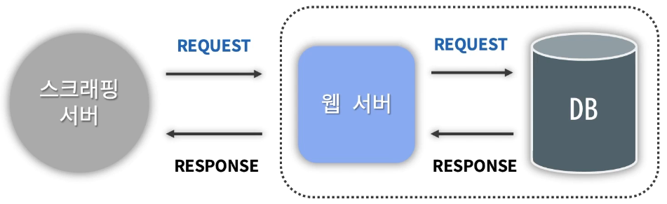

# 배당금 프로젝트

## 웹 스크래핑
- HTML 문서를 받은 후
- 문서를 파싱(Parsing) 해서
- 필요한 데이터를 추출
 
## 모든 사이트에서 데이터를 마음대로 가져오면 안된다.
- 데이터는 회사의 중요 자산이다. (소송에 휘말릴 수도 있다.)
- 웹 서버의 부하 발생

## 웹 스크래핑 서버 형태

- 개발할 스크래핑 서비스는 또 다른 웹서버에 요청을 날리고, 응답으로 날아온 HTML 문서를 받아오는 걸로 시작된다.
- 내가 개발한 웹서버가 다른 웹서버에 어느정도 영향도를 갖고 있는지 파악하는 게 중요

## 스크래핑 할 때 주의사항
- 스크래핑 가능 웹 사이트인지 판단하는 방법은 Robots.txt 문서에서 규칙을 정의해서 적어놓는다.
  - 트래픽 제한
  - 다른 서비스에서 데이터 가져가는 것을 원하지 않는 경우
- Disallow로 어떤 경로의 접근을 막는지 표시가 되어있다.
- Allow는 어떤 경로의 접근을 허락한다는 의미
- User-agent: *는 이 규칙 모든 Robots에 적용된다는 의미

- robots.txt에 정의된 규칙을 준수하고
- 요청 서버에 무리가 가지 않는 선에서 요청할 것
